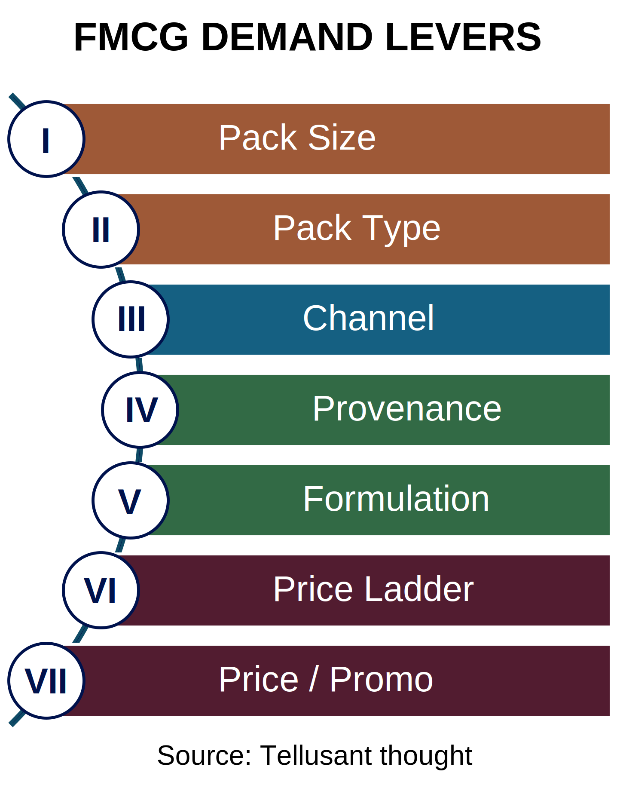

# FMCG Demand Levers
The graph summarizes the seven levers that always apply. Most readers will recognize them; the framework just creates a coherent whole.  

  
We trust each of the levers is self explanatory. The main observations are instead:  

The levers feed into the value proposition. That is: value = consumer benefits minus consumer price. A certain combination of levers define current — **Is** — and future — **Wish** — states (Is-Wish from control theory).  

The should state leads to higher level product ideas. Is the best offering a brand extension, a new brand, a new positioning, and so on?  

This in turn leads to marketing messaging.  

Only observable levers are included. We hold that it is impossible to fool consumers in the long run. Therefore, all product and marketing action has to be anchored in hard underlying attributes.  

For example, it is impossible to premiumize a product if it is not improved in some respect. There has to be a hard reason for paying the premium. Once this is established, it is possible to work on "softer" attributes such as community building, brand aura, or scarcity, to name a few.  

Tellusant, Inc.'s strategic forecasting app hashtag#PolusSim takes these levers into account. How many are included depend on user needs.  

We have worked with these levers since the 2000s, so this is not a "I got inspired at the white board" type of framework. In fact, we wrote about it in 2022 in light of high inflation: https://lnkd.in/eHzSuEPj. We have also used it in a myriad of client discussions.  
