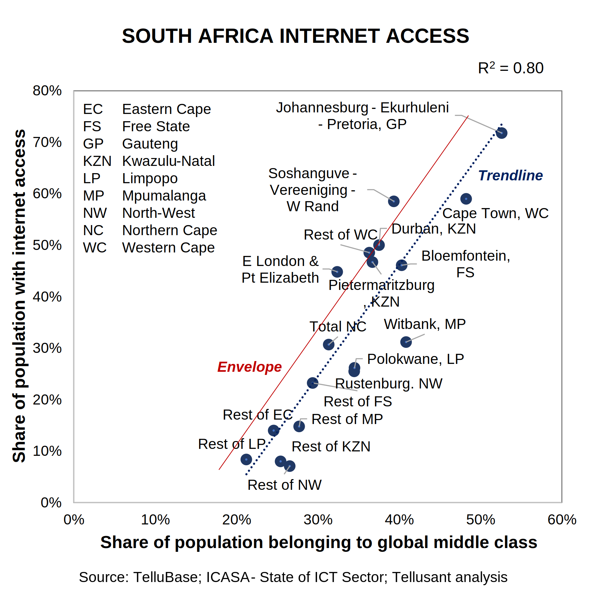
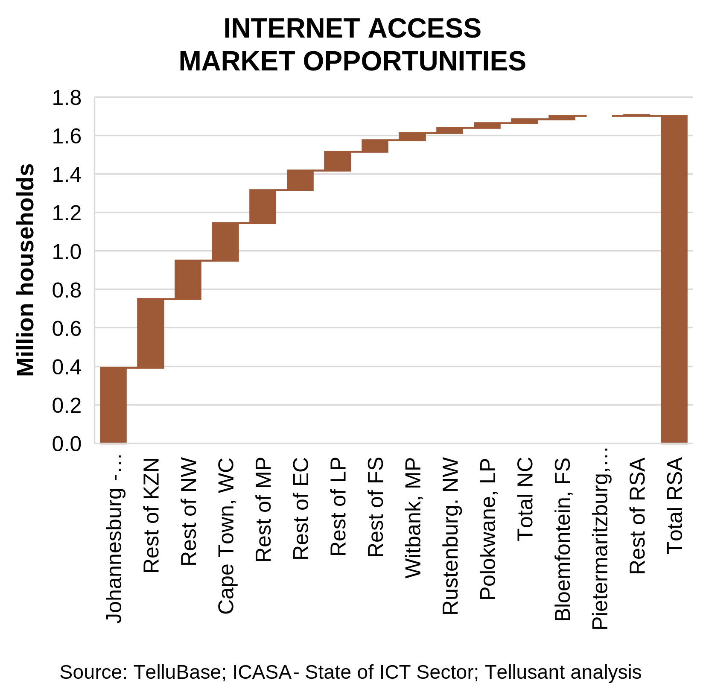

# Subnational ICT Opportunities in South Africa
## Case Example for How to Use TelluBase Income Distribution Data  

There is a strong trend among global companies toward understanding markets at subnational levels. They always face local players who have a keen sense for subnational opportunities.  

**TelluBase** is immensely useful for understanding subnational markets. It contains macro and consumer data for 218 countries, 2600 cities, and 2500 subdivisions (states, provinces, regions, etc.)  

The power of TelluBase is when its statistically data are combined with industry and category. The data on their own can be illuminating ("the middle class and above in Lima is growing at 8% per year"), but the combination with other data is what leads to true insights and action ("we see an untapped market opportunity for our toothpaste at a mainstream price point of 200 million people in 2035, up from 80 million today").  

To illustrate with numbers, we turn to South Africa. 

#### The South African Internet Opportunity

It is rare to find subnational industry or category data in the public domain. We always source this from our clients with requisite permissions.  

We did however find a public report in South Africa when working for an investment bank on local ICT opportunities.

The ICASA report [*The State of the ICT Sector*](assets/support/State-of-ICT-Sector-Report-March-2022.pdf) among other things showed the number of internet users for major cities and all states. How is this converted into something analytically useful?  

We set as our objective to identify the internet over- and under-penetration for each of these geographic entities and then derive the latent market opportunity. The process was:

1. Develop the internet penetration metric. ICASA did not have this in a clean fashion. We therefore used AND and OR statements to combine ICASA data into a singular metric.
2. Match the entities in the ICASA report to TelluBase. This was easy because the cities in ICASA were covered in **TelluBase**
3. 

  

  

---
This effort built on Tellusant's long and deep telecom knowledge (see [Staffan Canback](https:https://www.linkedin.com/in/scanback/) and [Kennet Rådne](https://www.linkedin.com/in/kennetradne/)).  
