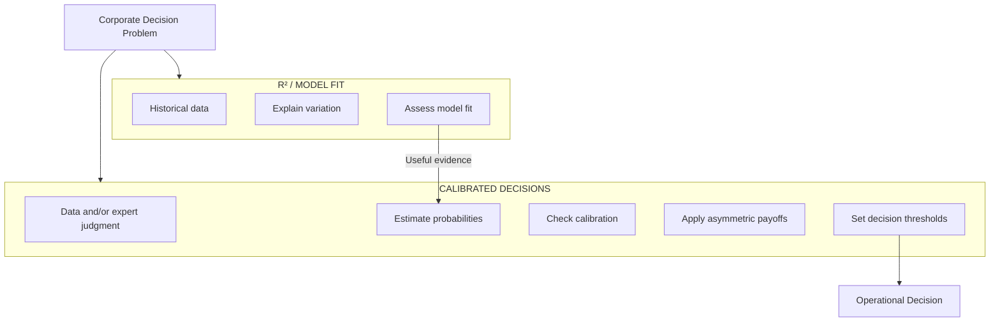

# Calibrated Decisions vs. R-Squared for Corporate Teams

Corporate teams frequently rely on $R^2$ as a familiar measure of explanatory power. But $R^2$ and **Calibrated Decisions (CD)** answer different questions. $R^2$ evaluates how well a statistical model explains variation in observed outcomes; calibration evaluates whether stated probabilities correspond to observed frequencies. CD goes one step further by combining reliable probabilities with economic payoffs and decision thresholds to guide action.

The distinction matters because many important corporate decisions are not primarily about explaining the past. They are about choosing what to do under uncertainty.

---

## 1. The Core Pitch: Explanatory Power vs. Operational Utility

* **$R^2$ measures explanatory fit.** It asks: *"How much of the variation in the observed outcome does this model explain relative to a baseline?"* A high $R^2$ can indicate strong in-sample fit, but by itself it does not tell a manager whether a stated probability is reliable or whether a particular action has positive economic value.
* **Calibration measures probabilistic reliability.** It asks: *"When we assign an event an 80% probability, do events assigned roughly 80% probabilities occur about 80% of the time?"* Good calibration makes probabilities operationally interpretable (DeGroot and Fienberg 1983; Gneiting and Raftery 2007).
* **Calibrated Decisions connect probability to action.** Once probabilities are sufficiently reliable, they can be combined with asymmetric gains, losses, constraints, and decision thresholds to determine what action is economically justified.

A useful summary is:

> **$R^2$ evaluates explanatory fit; calibration evaluates probabilistic reliability; decision economics determines what to do.**

---

## 2. Why CD Applies to a Broader Decision Domain

The two approaches are therefore not substitutes in every setting. Model fit can provide useful evidence inside a broader decision process. The key difference is that CD is explicitly designed to carry uncertainty through to an operational choice.

### A. CD can incorporate expert judgment when historical evidence is limited

$R^2$ requires an estimated statistical model and observed outcomes against which model fit can be assessed. When a team faces a genuinely novel macroeconomic shock, new technology, market entry, regulatory change, or other situation with little relevant historical evidence, $R^2$ may offer limited guidance.

CD can additionally incorporate **calibrated expert probabilities**. An executive or subject-matter expert can state a probabilistic estimate even when a conventional regression model is unavailable. The quality of that estimate can then be assessed over repeated forecasts using calibration performance. Calibration training, repetition, and feedback can also improve people's ability to assess uncertainty probabilistically (Hubbard 2010).

Calibration does not make an individual forecast certain. It means that, across comparable forecasts, stated probabilities correspond reasonably well to observed frequencies.

### Measuring probability quality: the Brier score

Calibration can be examined directly with reliability diagrams and related diagnostics, but probabilistic forecasts can also be evaluated with **proper scoring rules**. For binary events, the classic **Brier score** measures the squared difference between a stated probability $p$ and the realized outcome $o$, where $o=1$ if the event occurs and $o=0$ otherwise (Brier 1950; Gneiting and Raftery 2007):

$$
BS = (p-o)^2
$$

Lower scores are better. A forecast of 80% followed by occurrence of the event receives a score of $(0.8-1)^2=0.04$; the same forecast followed by non-occurrence receives $(0.8-0)^2=0.64$. Across repeated decisions, scoring rules provide a disciplined way to track the quality of probability estimates rather than relying on confidence or model fit alone. Calibration remains a distinct property: a forecaster can be calibrated yet insufficiently discriminating, so both reliability and the informativeness of the probabilities matter (DeGroot and Fienberg 1983; Gneiting and Raftery 2007).

### B. CD handles asymmetric corporate payoffs directly

Standard $R^2$ is derived from squared prediction errors and is indifferent to the economic consequences of those errors. In business, however, a false positive and a false negative can have radically different financial consequences.

CD separates two questions that should remain separate:

1. **How likely is each outcome?**
2. **What is each outcome worth if we act or do not act?**

This allows probabilities to be combined directly with an economic payoff matrix rather than treating statistical fit as the decision criterion.

### C. CD naturally supports binary and threshold actions

Many corporate choices are discrete: invest or do not invest, enter or stay out, launch or delay, hedge or remain exposed, approve or reject. In such settings, overall variance explained may be less important than whether estimated probabilities are sufficiently reliable around the threshold at which the preferred action changes.

$R^2$ can still be informative about an underlying model, but it is not itself a decision rule. CD makes the decision threshold explicit.

---

## 3. Decision Economics: The Payoff Matrix

The following example shows how a model with **low explanatory power can still support a valuable decision when the relevant probability estimate is well calibrated and the payoff structure is strongly asymmetric.**

### Scenario: Deep-Tech R&D Capital Allocation

A corporate venture team is deciding whether to invest **$10,000,000** in an early-stage deep-tech R&D project.

* **Success outcome:** The project succeeds, yielding a net payout of **$100,000,000**, equivalent to a **$90,000,000 net profit** after the investment.
* **Failure outcome:** The project fails, resulting in a loss of the **$10,000,000** investment.

### The Decision Model

Suppose the engineering team's model explains little of the overall variation in ultimate project returns, with **$R^2 = 0.05$**. If the model were judged only by explanatory fit, it would appear weak.

However, suppose that within a defined class of high-potential projects, cases assigned a **15% probability of success** succeed approximately 15% of the time. The 15% probability estimate is therefore well calibrated for that class of decisions.

### The Payoff Matrix and Expected Value ($EV$)

| Decision / State | Project Fails ($P = 0.85$) | Project Succeeds ($P = 0.15$) |
| :--- | :--- | :--- |
| **Invest ($D_1$)** | -$10,000,000 | +$90,000,000 |
| **Do Not Invest ($D_2$)** | $0 | $0 |

The expected value of investing is:

$
EV(D_1) = P(\text{Success}) \times \text{Payoff}_{\text{Success}} + P(\text{Failure}) \times \text{Payoff}_{\text{Failure}}
$

$$
EV(D_1) = (0.15 \times \$90{,}000{,}000) + (0.85 \times -\$10{,}000{,}000)
$$

$$
EV(D_1) = \$13{,}500{,}000 - \$8{,}500{,}000 = +\$5{,}000{,}000
$$

The expected value of not investing is:

$$
EV(D_2) = \$0
$$

So, under these assumptions:

$$
EV(D_1) - EV(D_2) = +\$5{,}000{,}000
$$

### The Decision Threshold

The same example can be expressed as a minimum probability required to justify investment. Let $p$ be the probability of success. Investing is preferred when:

$$
p(\$90{,}000{,}000) + (1-p)(-\$10{,}000{,}000) > 0
$$

Solving for $p$ gives:

$$
100{,}000{,}000p > 10{,}000{,}000
$$

$$
p > 0.10
$$

The **break-even probability is therefore 10%**. A calibrated estimate of 15% exceeds that threshold, so the economically preferred action is to invest.

This is the essential CD logic: the decision depends not on whether $R^2$ is high, but on whether the relevant probability estimate is reliable enough and whether it lies above or below the economically meaningful threshold.

### Corporate Conclusion

* **An $R^2$-focused interpretation:** The model appears weak because it explains only 5% of overall variation. If explanatory power were the primary evaluation criterion, the model might be dismissed.
* **The Calibrated Decisions interpretation:** The relevant probability estimate is 15%, while the economic break-even threshold is 10%. Given the stated payoffs, investing has an expected value of **+$5,000,000**.

The example does not show that $R^2$ is unimportant. It shows that **model fit and decision value are different quantities**. A model can explain little overall variation yet still contain information that is economically valuable at a specific decision threshold.

---

## 4. The Conceptual Analogy for Non-Statistical Teams

Consider a weather forecaster.

* **The $R^2$ perspective:** A model may explain a large share of historical variation in rainfall amounts. That is useful evidence about fit, but it does not by itself establish that statements such as "70% chance of rain" are probabilistically reliable.
* **The calibration perspective:** If, across a large set of days assigned a 30% probability of rain, rain occurs about 30% of the time, the forecast is well calibrated at that probability level.

A calibrated probability can then be combined with the economics of the decision. If an outdoor event organizer knows the probability of rain, the cost of renting a tent, and the loss associated with being caught without one, the organizer can determine the probability threshold above which renting the tent is economically justified.

Calibration does not guarantee the outcome of any single event. It makes the probability estimate interpretable enough to support a disciplined decision rule (DeGroot and Fienberg 1983).

---

## 5. The Practical Corporate Use Case

For corporate teams, the value of CD is not that it replaces statistical modeling. It is that it provides a common decision language across situations with very different evidence bases.

A CD process can combine:

* statistical models where reliable historical data exist;
* expert estimates where data are sparse or the situation is novel;
* explicit probability calibration;
* asymmetric gains and losses;
* decision thresholds derived from economics rather than convention; and
* repeated feedback so that both models and human estimators improve over time.

This makes CD especially useful for strategic decisions where uncertainty is unavoidable but inaction is itself a decision. The broader principle is to define and evaluate uncertainty in relation to the decision it is intended to support (Hubbard 2010).

### The central distinction

| Question | Primary Tool |
| :--- | :--- |
| How well does the model explain observed variation? | $R^2$ and other fit measures |
| Are stated probabilities reliable? | Calibration |
| What are the economic consequences of each outcome? | Payoff analysis |
| At what probability should the action change? | Decision threshold |
| What should we do? | **Calibrated Decision** |

In that sense, $R^2$ can be an input to a decision process. **Calibrated Decisions are the process that turns uncertain evidence into an economically explicit action.**

---

## References

[Brier, Glenn W. 1950. “Verification of Forecasts Expressed in Terms of Probability.” *Monthly Weather Review* 78 (1): 1–3.](https://doi.org/10.1175/1520-0493(1950)078<0001:VOFEIT>2.0.CO;2).

[DeGroot, Morris H., and Stephen E. Fienberg. 1983. “The Comparison and Evaluation of Forecasters.” *Journal of the Royal Statistical Society. Series D (The Statistician)* 32 (1–2): 12–22.](https://doi.org/10.2307/2987588).

[Gneiting, Tilmann, and Adrian E. Raftery. 2007. “Strictly Proper Scoring Rules, Prediction, and Estimation.”*Journal of the American Statistical Association* 102 (477): 359–378.](https://doi.org/10.1198/016214506000001437).

[Hubbard, Douglas W. (2007) 2014. *How to Measure Anything: Finding the Value of Intangibles in Business*. 3rd ed. Hoboken, NJ: John Wiley & Sons.](https://www.amazon.com/How-Measure-Anything-Intangibles-Business/dp/1118539273/ref=sr_1_1?nsdOptOutParam=true&sr=8-1)
