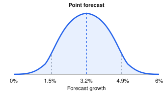

# Building a Proprietary AI Forecasting System

> If my colleagues and I were to build our own AI system with System 1 logic (not using existing systems like Jev), what are the critical components? Back-propagation? Calibrated decisions? Anything else? 
>
> It is for continuous math, not classification. Specifically demand forecasting, productivity forecasting, and risk forecasting for countries or companies (3 by 2 matrix without interconnections, so 6 models, starting the work with 1). We have the data and have modeled the historical behavior.
>
> We want it to be robust in the sense that when we make the AI claim, it holds up to scrutiny by outsiders. (And it should work.)

## Executive summary

Tellusant can build a proprietary AI forecasting system using its existing historical datasets and econometric models as a foundation. The objective is to learn from historical economic and corporate behavior, produce continuous numerical forecasts, quantify uncertainty, and improve performance through systematic validation and recalibration.

This does **not** require training a large language model, inventing a new optimization algorithm, using an external AI platform, or necessarily using a neural network. It does require an implemented learning process and credible out-of-sample evidence. A hybrid econometric–machine-learning architecture is a promising starting point, subject to empirical testing.

> **Proposed objective:** Develop a proprietary, data-driven AI forecasting system that learns from historical economic and corporate behavior, generates continuous numerical forecasts, quantifies uncertainty, and improves through systematic validation and recalibration.

## 1. Scope: six independent models

| Forecasting domain | Countries | Companies |
|:--|:--|:--|
| Demand | Model 1 | Model 2 |
| Productivity | Model 3 | Model 4 |
| Risk | Model 5 | Model 6 |

Each model has its own target, data, parameters, training, and validation. The six models need not interact, although they can reuse common software and learning infrastructure. Start with one model and extend the tested architecture to the others.

Six independent models do **not** imply six distinct learning algorithms. A common learning engine can serve separate models.

## 2. Critical components

| Component | Priority | Function |
|:--|:--|:--|
| Forecast target and horizon | Essential | Specify the numerical outcome, forecast date, and horizon |
| Information set and data vintages | Essential | Restrict predictors to information available when the forecast is issued |
| Objective/loss function | Essential | Define what the algorithm minimizes or optimizes |
| Learning/estimation algorithm | Essential | Estimate or update parameters from observations |
| Backpropagation | Conditional | Efficiently compute gradients in neural networks and other differentiable computational graphs |
| Temporal out-of-sample validation | Essential | Establish performance on data not used for fitting or tuning |
| Baselines and model comparisons | Essential | Demonstrate incremental predictive value |
| Regularization | Very high | Control complexity and overfitting |
| Uncertainty estimation | Very high | Generate predictive intervals, quantiles, or full distributions |
| Probabilistic calibration | Very high | Evaluate whether forecast probabilities match realized frequencies |
| Monitoring and retraining | Essential for production | Detect deterioration and refresh the model under controlled rules |
| Economic constraints | Highly desirable | Respect identities, feasible bounds, and known economic relationships |
| Explainability, versioning, auditability | Highly desirable | Support interpretation, governance, and reproducibility |

The key distinction is between a historical model that has been fitted once, a machine-learning forecasting process that is evaluated and updated, and a production forecasting system with monitoring and governance.

## 3. The mathematical learning core

Let the continuous forecast for horizon $h$ be

$$
\hat y_{t+h}=f_{\theta}(X_t),
$$

where $X_t$ is the information available at time $t$, $h$ is the forecast horizon, and $\theta$ is the set of learned parameters.

A basic squared-error loss is

$$
L(\theta)=\frac{1}{N}\sum_{i=1}^{N}(y_i-\hat y_i)^2.
$$

For a differentiable model, one possible learning rule is gradient descent:

$$
\theta_{k+1}=\theta_k-\eta\nabla_{\theta}L(\theta_k),
$$

where $\eta$ is the learning rate. Backpropagation computes the gradients efficiently for neural networks; the optimization step is conceptually distinct from backpropagation itself.

**Backpropagation is not a universal requirement for AI.** Many strong continuous forecasting methods use other estimation or optimization techniques.

| Approach | Requires neural-network backpropagation? | Potential role |
|:--|:--|:--|
| Regularized regression | No | Transparent and strong benchmark |
| ARIMA and state-space models | No | Time-series dynamics and latent states |
| Gradient-boosted trees | No | Nonlinear tabular predictors and interactions |
| Neural networks | Usually | Flexible nonlinear functions, especially with sufficient data |
| Bayesian dynamic models | Not necessarily | Parameter and predictive uncertainty |
| Gaussian processes | Not necessarily | Flexible regression and uncertainty in smaller datasets |

**Selection principle:** Use the simplest method that performs reliably on realistic out-of-sample forecasts. Neural networks should earn their place by outperforming alternatives, not by virtue of being labeled AI.

## 4. Hybrid econometric–machine-learning design

Tellusant already has historical models. Rather than discard them, consider using them as an economic foundation. Three plausible configurations are:

1. **Econometric baseline plus ML residual correction:** predict with the established model and train ML on historically available residual patterns. Residual training and testing must be conducted without leakage.
2. **Economically informed ML:** include theoretically relevant predictors, transformations, and constraints in a flexible learning algorithm.
3. **Model ensemble:** combine independent econometric and ML forecasts, with combination weights determined from past out-of-sample results rather than the final test period.

These are alternatives to test, not assumed improvements. Residual correction can amplify noise if it is not properly regularized.

Panel data may be especially valuable: a country forecasting model can learn common relationships across countries while allowing country-specific effects; likewise for firms. Pooling within a model does not require connections among the six models.

## 5. Continuous forecasts and uncertainty

I would make calibration a distinguishing feature of the Tellusant system.  

A point forecast, such as 3.2% growth, is useful but incomplete. A predictive distribution also characterizes uncertainty and downside outcomes.  

**Illustrative, not estimated:**  

- Point forecast: 3.2% growth.
- Nominal 80% prediction interval: 1.5%–4.9%.
- A calibrated 80% interval should cover approximately 80% of future observations over an appropriate evaluation sample.

For a predictive cumulative distribution $F_t(y)$, calibration can be assessed using probability integral transform diagnostics, quantile coverage, and interval coverage. Forecast quality also depends on **sharpness**: excessively wide intervals may achieve coverage while offering little decision value.

Recommended diagnostics include:

- Point forecast error: MAE, RMSE, and where appropriate scale-free measures.
- Predictive distributions: continuous ranked probability score (CRPS) or other proper scoring rules.
- Interval performance: empirical coverage and interval width, by horizon and regime.
- Quantiles: quantile/pinball loss and empirical quantile coverage.
- Downside risk: tail quantiles, exceedance probabilities, and stability under adverse conditions.

**Calibration is not the learning algorithm.** It is a property of probabilistic forecasts and may be improved with a separate calibration stage. A calibrated forecast is not necessarily accurate in point terms, and an accurate point forecast is not necessarily calibrated.

Calibration procedures must be fitted using historical calibration data, not the final untouched test set. Coverage can vary across countries, companies, horizons, and structural regimes; pooled coverage alone can conceal poor subgroup performance.

## 6. Proposed end-to-end architecture

%%{init: {'themeVariables': { 'fontFamily': 'Arial'}}}%%
    
flowchart TD

    A["`Proprietary historical  data and data vintages`"]
    B["`Existing econometric model  and economic constraints`"]
    C["`Learning engine: loss,  estimation, regularization`"]
    D["`Rolling-origin validation  and benchmark comparison`"]
    E["`Predictive distributions  and calibration`"]
    F["`Point forecasts, intervals,  and downside probabilities`"]
    G["`Monitoring, governance,  and controlled retraining`"]

    A --> B --> C --> D --> E --> F --> G
    G -. "`New observations and  scheduled model review`" .-> C

    classDef blue fill:#E3F2FD,stroke:#0D47A1,stroke-width:2px,color:#111;
    classDef green fill:#E8F5E9,stroke:#1B5E20,stroke-width:2px,color:#111;
    classDef red fill:#FFEBEE,stroke:#B71C1C,stroke-width:2px,color:#111;
    class A,B,C blue;
    class D,E green;
    class F,G red;

This diagram represents one model's lifecycle. The same infrastructure may be instantiated separately for all six models.

## 7. Validation: what makes the results credible

Forecasting validation must respect time. Random train/test splitting can be misleading when observations are serially dependent or when predictors contain revised information.

Use **rolling-origin backtesting**:

1. Select a historical forecast origin $t$.
2. Construct the data vintage and predictor information that would have been available at $t$.
3. Fit or update the model using only eligible historical data.
4. Issue the forecast for $t+h$.
5. Compare it with the chosen definition of realized outcome.
6. Advance the origin and repeat.

Specify in advance whether realized outcomes are first releases, subsequently revised estimates, or another clearly defined target. For companies, use publication dates of financial statements and other data, not merely their fiscal period labels.

Compare the new system with the existing econometric model and at least one simple forecasting baseline. Tune hyperparameters using training/validation periods; reserve a final chronological test period for an unbiased evaluation. Where practical, use nested or otherwise carefully separated temporal validation.

Assess results by horizon, geography or firm group, economic regime, and forecast origin. Examine both average performance and failure cases. Avoid claiming improvement on the basis of a single favorable test period.

## 8. Economic constraints and model governance

Economic structure is an asset, not an obstacle. Depending on the target, relevant safeguards include:

- Nonnegativity or other feasible bounds for levels and rates.
- Accounting identities and aggregation consistency where applicable.
- Explicit treatment of structural breaks and revisions.
- Documented predictor definitions, transformations, and missing-data procedures.
- Separate model version, data vintage, code version, and forecast issue timestamp.
- Audit trail for retraining, overrides, and changes in specification.

For risk models, define the target precisely: volatility, downside deviation, probability of a threshold event, expected shortfall, or another continuous metric. These are different forecasting problems. A continuous risk forecast can also produce event probabilities as derived outputs without turning the core model into a classification system.

## 9. Implementation roadmap for the first model

### Phase 1 — Define and freeze the baseline

Specify the outcome, unit of observation, horizon(s), information set, historical data vintages, existing model, and benchmark metrics. Freeze the benchmark before testing candidate improvements.

### Phase 2 — Build the learning candidates

Start with regularized regression and gradient-boosted trees. Evaluate a neural network only if the available sample size and predictive gains justify the added complexity. Consider residual learning or forecast ensembles alongside direct ML.

### Phase 3 — Backtest

Run rolling-origin forecasts with leakage controls, a separate tuning period, and an untouched final test period. Compare against established and simple baselines.

### Phase 4 — Quantify uncertainty

Produce quantiles, intervals, or predictive distributions using an appropriate method: quantile regression, distributional modeling, bootstrap approaches, Bayesian methods, or conformal prediction. Each has assumptions and limitations, especially under temporal dependence and regime change.

### Phase 5 — Test calibration and usefulness

Measure point accuracy, proper probabilistic scores, empirical coverage, interval sharpness, downside performance, and stability across relevant subsets. Where decisions are the objective, evaluate the consequences of using forecasts, not only statistical accuracy.

### Phase 6 — Deploy controlled updates

Set rules for retraining frequency, monitoring thresholds, data revisions, model promotion, rollback, and archiving. Retraining is not automatically an improvement: candidate models should pass defined acceptance tests.

### Phase 7 — Replicate the infrastructure

After the first model passes acceptance criteria, adapt the pipeline to the other five independent models. Revalidate each model separately; success in one domain does not prove success in another.

## 10. Calibrated forecasts versus calibrated decisions

These concepts should be distinguished:

- **Forecast calibration:** Are predictive probabilities, intervals, and quantiles statistically consistent with outcomes?
- **Decision calibration:** Given a calibrated forecast and the relevant costs, benefits, constraints, and asymmetries, does the decision rule choose appropriate actions?

For example, a forecast distribution may estimate the probability of a negative demand shock. A separate decision layer can compare expected payoffs of expanding capacity, maintaining capacity, or reducing exposure. That layer requires decision-specific loss/payoff assumptions and is **not** a prerequisite for building the forecasting engine.

For a continuous forecast distribution $F$, a stylized optimal decision is

$$
a^*=\arg\min_a\,\mathbb{E}_{Y\sim F}[C(a,Y)],
$$

where $C(a,Y)$ is the cost of action $a$ when outcome $Y$ occurs. Asymmetric costs can justify thresholds different from those implied by symmetric forecast error.

Thus **calibrated forecasting is central to the proposed first model**; a calibrated decision-support layer can be added when users' decision costs and actions are defined.

## 11. What can credibly be claimed?

| Claim | Supporting evidence |
|:--|:--|
| Proprietary forecasting model | Own data, specifications, and estimation methodology |
| Proprietary machine-learning forecasting system | Implemented learning, objective functions, repeatable forecasting, and genuine out-of-sample evaluation |
| Proprietary AI forecasting system | Operational ML-based forecasting capability, documented validation, and an explicit process for updating and governing models |

AI is a broad term that includes machine learning; a neural network or generative model is **not** required. Conversely, merely automating a fixed historical regression is a weaker basis for an AI claim.

**Suggested description once a first model is operational and validated:**

> Tellusant develops proprietary AI forecasting models that combine economic modeling, machine learning, and probabilistic calibration to forecast demand, productivity, and operating risk across countries and companies.

Until all six are operating, distinguish the implemented model(s) from models still under development. Avoid asserting superior predictive accuracy unless out-of-sample evidence supports it.

## 12. Interpreting “System 1”

If “System 1” refers to Kahneman's fast, automatic, pattern-based cognition, it can serve as a loose analogy for learned pattern recognition. It is **not** a specified mathematical forecasting architecture. The distinction between fast pattern recognition and slower explicit reasoning does not determine whether to use gradient boosting, neural networks, Bayesian models, or econometrics.

A practical combination is explicit economic structure plus statistical learning of nonlinearities, residual behavior, and changing relationships. This is an engineering and empirical design choice rather than an attempt to reproduce human cognition.

## 13. Final recommendation

Build a **hybrid econometric–machine-learning forecasting system with probabilistic calibration**, beginning with the model offering the best combination of reliable observations, well-defined target, data vintages, and measurable forecasting performance.

Prioritize, in order: leakage-free data preparation, a clear forecasting objective, a repeatable learning method, rigorous rolling-origin validation, predictive uncertainty, calibration, and governed retraining. Use backpropagation only if a neural-network architecture demonstrates value.

The first milestone is not a sophisticated neural network; it is a defensible demonstration that the proprietary learning system produces useful, reproducible, genuinely out-of-sample continuous forecasts.
